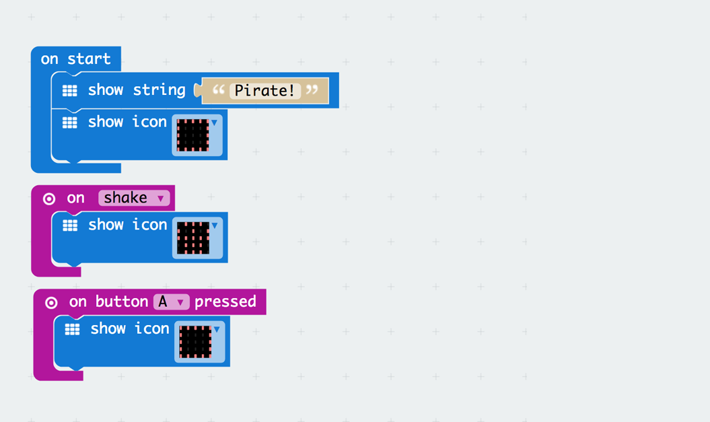
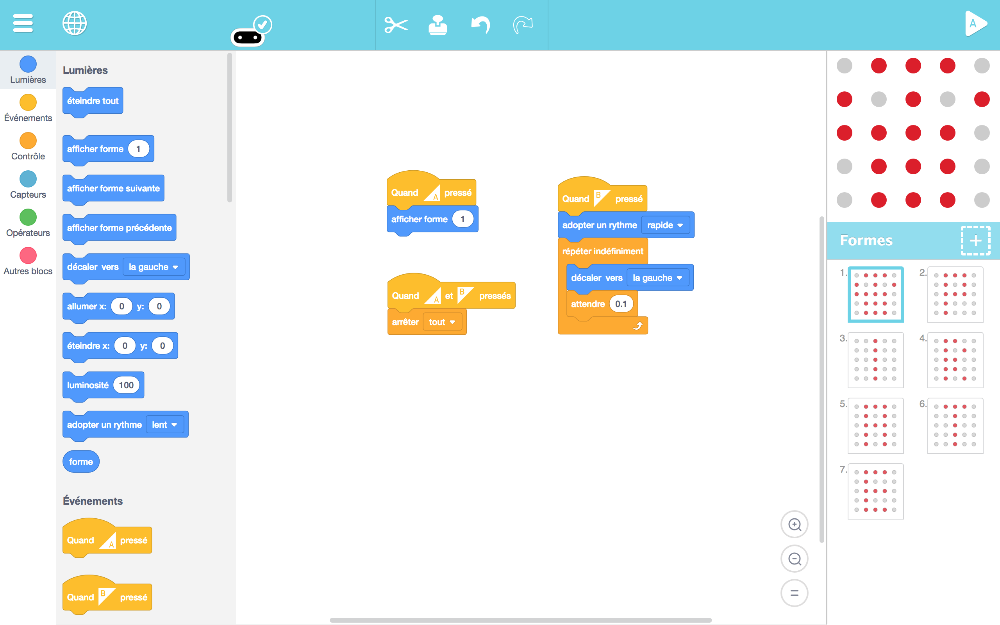

# DAY 1: Create your pirate identity

Pirates get to know each other and learn to bond as a team.

## 1. Introductory unplugged activity 

### The pirate's Web (inspired by RTP Hero's Web)

> INDOOR or OUTDOOR

A game for every pirate to share their names and nicknames.

1) Give a sticker to each kid so they can write their names and stick them on there t-shirt
2) First Round: Pass a ball around and tell the name of the person you pass the ball to. 
3) Second round: Pass around a bundle of string. Create a tangle of strings, then pass the bundle backward to untangle.
4) Third Round: Use your Pirate nicknames.
5) Ask questions on how complicated looked the tangle, etc.

```diff
Feed back of tests with KCJ team (18-06-2018): 
- Going backward breaks the rythm, makes the game too slow.
+ Consider making the web first, then throwing a ball (make it a memory game)
+ Untangling is a lot of fun
```
## 2. Microbit activity

### The iPatch: an electronic eye patch for cool pirates

> mainly INDOORS or OUTDOORS in shaded area

```diff
+ TODAY WE LEARN:
1. What is a Microbit? 
2. Similarities between Microbit and Pirates (humans)
3. Makecode Interface and menus to program in Visual Code 
4. How to send a program from a PC to a Microbit
5. Play with a simple Microbit first **program**
```

1. Create a 5x5 pixels animated avatar
2. Write a program to display it on the microbit LED array
3. Download your pixel artwork to the microbit
- First Download => create 2 static avatars and switch using Button A
- Second Download => Create your own image and use onShake to display it
- Third Download => Create an animation using a loop and use input B or A+B to start it

4. Stick the microbit to an eye patch and there you go, you have an iPatch.

> Prepare also a necklace with Battery Back Plate

### 2.1 Blocks Code

### 2.2 Text Code
```javascript
input.onGesture(Gesture.Shake, () => {
    basic.showIcon(IconNames.Skull)
})
input.onButtonPressed(Button.A, () => {
    basic.showIcon(IconNames.Square)
})
basic.showString("Pirate!")
basic.showIcon(IconNames.Square)
```

## 2b. Artbit - begginers - Image creation

```diff
+ TODAY WE LEARN:
1. What is a Microbit? 
2. Similarities between Microbit and Pirates (humans)
3. ArtBit Interface 
4. How to send a program from a PC to a Microbit
5. Play with a simple Microbit first **program**
```

1. Create their own nickname in Artbit
2. Create their own symbol in Artbit



## 3. The pirate dance - secret handshake

> INDOOR or OUTDOOR: (inspired from RTP Secret Handshake) / Maori-Pirate Choreography

A game for the pirates to bind with their team mates by inventing a secret hand shake. 
1) The group is divided into two or three teams.
2) Each group creates a secret hand shakes that involves at least 3 mouvements (at most 5)
3) One or two representent of each team have to go and show the other teams there secret handshake with showing them with their hands.  
4) We will made them crete their own Pirate Gang War-dance

```diff
Feed back of tests with the KCJ team (18-06-2018):
1. Make the kids invent a dance move based on a 2 to 3 syllable word
2. Decompose the danse into 2 to 3 parts, one for each syllable to keep the rythm.
``` 

## 4. Conclusions 

### Ages: 5-7
1. **Unplugged Activities**

At this age the presentations have to be really simple. Just with a round with the ball is enough to do a quick introduction. The rope game was interesting but you have to have the right width and start from really close to have success. At this age the simpler the better.

2. **Coding**

We have seen that ArtBit was a better option than microbit at early age becaue of it's simplicity and faster interaction. Just the fact of seeying live what you are doing makes a big difference. We started designing very simple pixel art drawings and with an introduction to buttons and sensors like onshake.

3. **Taking the code out**

The pirate I-Patch activity was perfect for this age. Because of it's simplicity and easy to adapt was well received and everybody wanted an i-patch picture with it.

> DIFFICULTIES: The really small kids like 5yo are simetimes learning to read and to draw. At this early age we recommend almost only offline activities. Specially we would focus on drawing and developing this first level of abstraction. Once they can draw and properly represent a shape is possible to introduce them to the Artbit.


### Ages: 7-12
1. **Unplugged Activities**

The passing the ball, hitting with the ball and sharing the rope in a web games were good ways to start to know eachother and break the ice.

2. **Coding**

The Microbit was the right choice for this age because of it's large array of possibities. At this age and knowing what an USB key is, they have much less problems to download and execute the .hex files.

3. **Taking the code out**

The Pirate I-Patch activity is perfect also for this game. Within the low-floor / high-sealing philosophy it was perfect as a starting point.

> OBSERVATIONS: The fact that we use the MI-POWER backplate for mictobit did help a lot. This extra-unity powered with a 3V battery + ON/OFF switch + Speaker gave us a new world of possibilities and make working with the microbits much easier. We highly recommend to addapt all the Microbits with these plates when going to classes. Just the fact of having the tiny speakers doubles the practical usability of the unit for the calsses.


> Authors: B.Ferragut and D.Banville - June 2018

© 2012 - 2018 Kids Code Jeunesse | All Right Reserved


