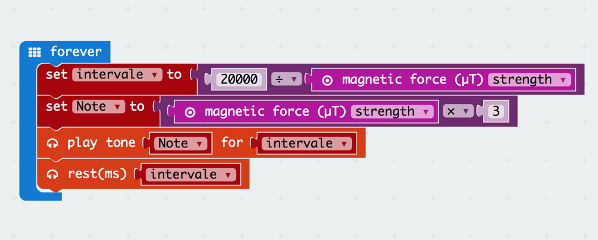
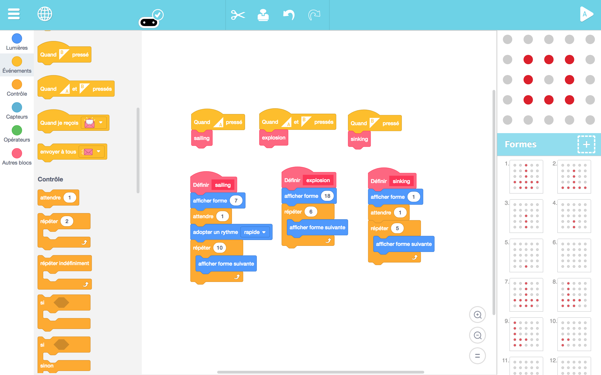

# DAY 2: Create the perfect pirate lair

Pirates need a place to relax and live a genuinly unproductive life.

## 1. Introductory unplugged activity 

### Build your pirate lair (inspired by RTP Architect) 
> INDOORS and OUTDOORS

The space will be divided in two (or three) areas, each with a theme, for example:
1. The relaxation area
2. The working space
3. The place to keep the treasure

In the center there is pile of objects to distribute in the different thematic areas. (we will need lots of elements, cussion, chairs, strings, branches...)

| Young kids (5 to 7) | Older kids (8 to 12) |
|---------------------|----------------------|
|1. Create two teams, one for each thematic area | 1. Create two (or three) teams, one for each thematic area |
|2. Create two (or three) categories of objects and ask the group to decide what object belongs where.|2. Create two (or three) categories of objects and ask the group to decide what object belongs where.|
|3. In each team, choose the 5 most important objects to place first. |3. In each team, choose the 5 most important objects to place first.|
|4. Open discussion with kids on where to place the selected items. |4. In each team, Architects are designated to draw a plan (top vue) of where each of the selected objects should go in the area.|
|5. Now is time to place the other objects and decorate the lair with objects from nature. |5. The teams rotate, but the Architects stay where the are. Each team has to follow thee instructions of the Architects to achieve the plan. |
|     | 6. Once every team is done building there part of the lair, now is time to place the other objects and decorate the lair with objects from nature.|
|6. Finaly, the kids design a pirate flag, and hang it to their lair|7. Finaly, the kids design a pirate flag, and hang it to their lair|

```diff
Feed back of tests with KCJ team (19-06-2018): 
+ Positive feedback of the activity
+ Take into acount extra time needed to decorate with natural elements
```

## 2. Microbit activity

> Prepare the MicroBit for fishing

```diff
+ TODAY WE LEARN:
1. What is magnetism? 
2. What is an interval in time and what is pitch in sound?
3. How are they interelated?
4. How a magnetic detector would work?
5. Play with a first program to detect magetism
```

### 2.1 Blocks Code

### 2.2 Text Code
```javascript
let Note2 = 0
let intervale = 0
basic.forever(() => {
    intervale = 20000 / input.magneticForce(Dimension.Strength)
    Note2 = input.magneticForce(Dimension.Strength) * 3
    music.playTone(Note2, intervale)
    music.rest(intervale)
})
```

## 2b. Artbit - begginers - animations

```diff
+ TODAY WE LEARN:
1. How to create pixel art animations
2. What is a function block
3. Play with a simple Microbit first **animation**
```

1. Create their own Fishing animation in Artbit 




## 3. It's time to go fishing

> INDOORS and OUTDOORS

Members of the crew program a microbit that detects magnetic fields and emit sound and light.
They can use it as a special fish finder to catch their dinner more efficiently. 

Material:
* A blanket to act as the see surface
* Cardboard fishies with magnets attached to them
* Fishing poles with a magnet attached to the string 

1) One Explorer is sent on the sea (blanket) with his MicroBit to find the Fish.
2) The Fisherman is standing outside the sea (blanket) with the fishing rod.
3) Other hold the blanket firmly to the ground
4) The goal is for the Fisherman to catch the fish with the help of the explorer
5) A sound is generated when a fish is catch. There is a sound for the sharks and a sound for real fish. If the sound for the shark is heard, everybody has to run for safety.
6) At first the fish are outside, after the fish are underneath and they pull the fish out
7) Give precise instructions to find the fish over the surface.

```diff
Feed back of tests with KCJ team (19-06-2018): 
+ Positive feedback of the activity 
+ Introduce to give directions to locate fish as a follow up of the first exercice
```

## 4. Conclusions 

### Ages: 5-7
1. **Unplugged Activities**

The game about dividing a pile into two different piles ( work/party) worked well. Time constraints did not allow to spend more energy into the building of the structures. 

2. **Coding**

With ArtBit we designed a simple story. A simple ship shape that is bombed and sinked. This simple secuential animation opened the eyes to the possibility of telling stories or to make simple animations. Ideally we noted that to really have real power telling stories the artbit should change or add some individual timelines for each of the functions. The Process with small kids was: 

- Start deawing the idea ( ex: a ship )
- Tell a story with that idea ( ship animation )
- Give them freedom to add their own personality

3. **Taking the code out**

At the same time they were creating their animations. A second and third person were preparing the fishing game. They wer called in pairs and one was selecting the fish with the magnet detector and the second one was fishing. Then they changed roles. 

> DIFFICULTIES: It was important to be opened to change plans fast because they tend to have a really short span of attention. The fishing game was and it's a great idea but in small batches. Make then play in turns gave us more control to the overall operation.


### Ages: 7-12
1. **Unplugged Activities**

The game about dividing a pile into two different piles ( work/party) worked well. Time constraints did not allow to spend more energy into the building of the structures. With more time, this game, can be a lot of fun and creativity.

2. **Coding**

We had the opportunity to start explainig how music is based on numbers with base 440Hz. Here we set the tone for this age to introduce variables and sound. Some of them could start creating their own music and adding the music to their first stories and animations. We had a lor of fun with this acticity and we opened the door rhe relationship between magnetima and sound - to science. 

3. **Taking the code out**

We proceeded with the same way than the younger ones and made them come by batches of 2. They really enjoyed the fishing activity and now they started to understand how the microbit was programmed to detect the magnetism and affed the sound!

> OBSERVATIONS: To do these activities we had to build special cases for the Microbits that allow us to control them with a switch ON/OFF and an INPUT Jack. Also we used a small sound system to amplify the effect of the sound. Sound became so imortant in the activities that we really encourage to boost up this feature specially with Artbit in the near future.


> Authors: B.Ferragut and D.Banville - June 2018

© 2012 - 2018 Kids Code Jeunesse | All Right Reserved

