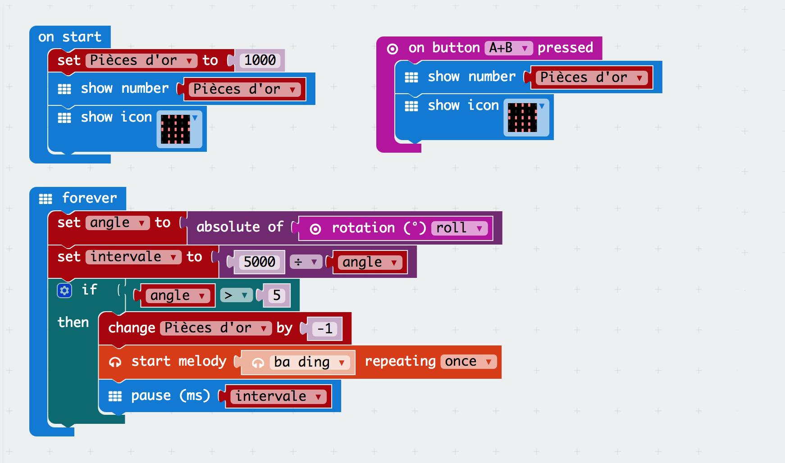

# DAY 3: Pirates Training Bootcamp

A pirate has to understand what value means and how to preserve it.

## 1. Introductory unplugged activity 

### Find precious goods (inspired by RTP Secret Mission)

The captain asks the crew to bring back precious goods but does not tell exactly what he is looking for.

He rejects or accepts objects based on a certain pattern the crew members have to discover.

Examples of pattern: 
- Things of red / blue
- Things of wood /  metal / rocks
- Things light / heavyig, big / small
- Worked by men or not, artificial / natural

> Create a small competition: The first who finds the Pattern wins Points

```diff
Feed back of tests with KCJ team (20-06-2018): 
+ Good feedback of the game. We will need to make a hughe pile of random items
+ Consider inlcude natural elements in the selection
+ Create a special place where old pirates deliver final decisions
```

## 2. Microbit activity

> Prepare the MicroBit for tilt detection based on the roll signal

We have 1000 coins and each time we tilt too much we lose either 1 or 10 coins. See how many coins are left in the coffin once the race end!

```diff
+ TODAY WE LEARN:
1. What is tilt? ( angles ) 
2. How can we relate tilt and sound?
3. What is a conditional in code?
4. What is a variable in code?
5. How can we create a coins counter?
6. Play with the tilt programs and see how affects the sound.
```

### 2.1 Blocks Code

### 2.2 Text Code
```javascript
let intervale = 0
let angle = 0
let Pièces_dor = 0
input.onButtonPressed(Button.AB, () => {
    basic.showNumber(Pièces_dor)
    basic.showIcon(IconNames.Skull)
})
Pièces_dor = 1000
basic.showNumber(Pièces_dor)
basic.showIcon(IconNames.Skull)
basic.forever(() => {
    angle = Math.abs(input.rotation(Rotation.Roll))
    intervale = 5000 / angle
    if (angle > 5) {
        Pièces_dor += -1
        music.beginMelody(music.builtInMelody(Melodies.BaDing), MelodyOptions.Once)
        basic.pause(intervale)
    }
})
```

## 2B. Art:Bit activity - code for begginers - Tilt sensor

1. They create their own Tilt animation in Art:Bit 

## 3. Proper treasure handling

Items in a treasure are often very fragile. The crew members have to write a microbit program to detect if a treasure item has been miss-handled using the gyroscope readings. They pratice extreme treasure handling in a obstacle course.

1. We create 1 progam that controls the sound interval and number of coins based on tilt.
2. The Sound program emits two different sounds to tell how extreme your tilt is
3. A great and difficult obstacle race is created where the participants have to 
move, jump, go up and down at a good speed until reach the end.
4. At the end of the race we see which participants conserve more coins in a linited amount of time.

```diff
Feed back of tests with KCJ team (20-06-2018): 
- We originally coded with separation of concerns. We saw that the code had to be unified.
+ Now it's such a beautiful unified piece of code!
```

> Authors: D.Banville and B.Ferragut
