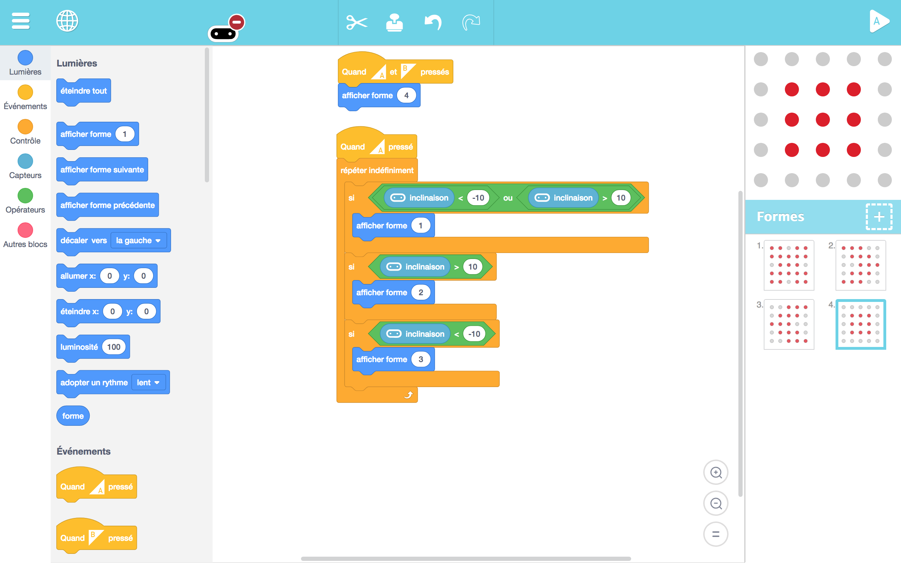
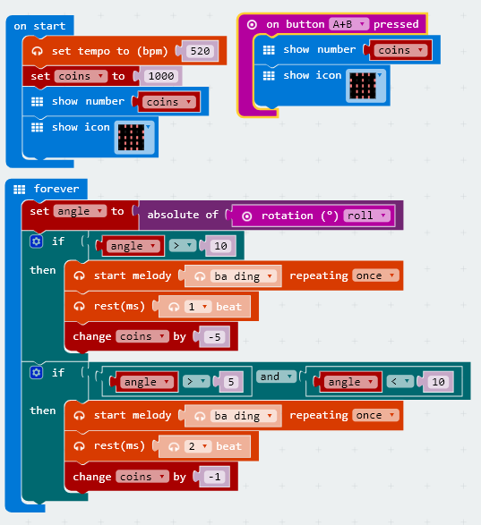

# DAY 3: Pirates Training Bootcamp

A pirate has to understand what value means and how to preserve it.

## 1. Introductory unplugged activity 

### Find precious goods (inspired by RTP Secret Mission)

The captain asks the crew to bring back precious goods but does not tell exactly what he is looking for.

He rejects or accepts objects based on a certain pattern the crew members have to discover.

Examples of pattern: 
- Things that are red / blue
- Things made of wood /  metal / rocks
- Things that are light / heavy, big / small
- Things worked by men or not, artificial / natural

> Create a small competition: The first who finds the Pattern wins Points

```diff
Feed back of tests with KCJ team (20-06-2018): 
+ Good feedback of the game. We will need to make a hughe pile of random items
+ Consider inlcude natural elements in the selection
+ Create a special place where old pirates deliver final decisions
```

## 2. Makecode coding session - Older kids (age 8 to 12)

Prepare the MicroBit for tilt detection based on the roll signal. We have 1000 coins at the begging. The more we tilt, the more coins we loose because the time interval between each coin drop is inversly proportionnal to the tilt signal. We can see how many coins are left in the coffin after the race.

```diff
+ TODAY WE LEARN:
1. What is tilt? (angles, pitch, roll) 
2. How can we relate tilt and sound?
3. What is a conditional in code?
4. What is a variable in code?
5. How can we create a coins counter?
6. Play with the tilt programs and see how affects the sound.
```

### 2.1 Blocks Code


### 2.2 Text Code
```javascript
let intervale = 0
let angle = 0
let Pièces_dor = 0
input.onButtonPressed(Button.AB, () => {
    basic.showNumber(Pièces_dor)
    basic.showIcon(IconNames.Skull)
})
Pièces_dor = 1000
basic.showNumber(Pièces_dor)
basic.showIcon(IconNames.Skull)
basic.forever(() => {
    angle = Math.abs(input.rotation(Rotation.Roll))
    intervale = 5000 / angle
    if (angle > 5) {
        Pièces_dor += -1
        music.beginMelody(music.builtInMelody(Melodies.BaDing), MelodyOptions.Once)
        basic.pause(intervale)
    }
})
```

## 3. Artbit coding session - Young kids (age 5 to 8)

```diff
+ TODAY WE LEARN:
1. What is tilt? (angles)
2. How can we relate tilt and an image?
3. Play with the tilt program and see how affects the pixel art image.
```




## 4. Take the code out!

> OUTDOORS


Items in a treasure are often very fragile. The microbit program detects if the treasure has been miss-handled by counting how many coins are left after transport using the gyroscope readings. The kids pratice extreme treasure handling in an obstacle course.

Material:
* A wood or plastic crate
* A microbit enclosure
* A speaker and an audio jack
* Some sturdy tape

1. We load the progam that counts the number of coins into the microbit. 
2. The program emits a coin drop sound so we need to plug the microbit to a speaker so everyone can hear.
3. We firmly tape the microbit enclosure and the speaker inside a crate which will act as our treasure chest.
4. Kids will be in teams of two to transport the crate across a great and difficult obstacle race.
5. At the end of the race we see on the microbit how many coins are left in the treasure chest after transport.
6. We keep track of the score of every team to create a little competition.

## 5. Changes to the plan

### Young kids (age 5 to 8)

We did not do the unplugged activity with the younger kids. As for day 2, we started with a calm drawing game instead. We had them draw treasure chests with lots of precious stuff for almost half an hour. Then we started coding. The kids used the tilt block to create a interactive animation and it worked fine. In the mean time, there was a treasure chest race going on outside with our helper instructor. When the kids were done coding, we got everyone outside and played the treasure chest race as a relay race with 4 to 5 teams of 2 kids. They had to pass the chest to the next team as fast a possible. It was a lot of fun.

### Older kids (age 8 to 12)

As for the fish detector code, the coin counter code is also not straight forward to understand for beginners. It requires a good understanding of the concept of variable and how mathematical operations can be applied to variables to create new usefull variables. For the demonstration we show a simpler version of the code which makes use of two conditionnals. All the elements are there to understand the principal of operation of the code used during the game.



## 6. Conclusions 

### Young kids (age 5 to 8)
1. **Unplugged Activities**

Drawing plays such an important role for this age group. It prepares the minds for abstract thinking so it is easier to have them code afterward. Unplugged activities foocusing on computational thinking through drawing and arts and crafts could be a very interesting improvement for this age group.

2. **Coding**

We tried to introduce the concept of tilt so they could understand the game they were going to play. For most of them, this was there first encounter with concepts such as angles and magnetism. We introduced conditionnal statements and the tilt sensor blocks in Artbit to created a ship that was tangling from side to side as you moved the Microbit. Older kids (7 - 8 years old) were able to do it, but young kids had troubles, they continued working on their animations.

3. **Taking the code out**

This game was a total success. The fact that they were all involved in the activity was very important. We ended up subdividing each of the teams in different pairs. They had to run with the treasure chest and pass the chest from couple to couple until they reached the end. Finally they count how much coins were left in the chest. Thanks to the sturdy chests we built the microbits could survive to such level of stress. This was a real bootcamp for the whole gear. We used our microbit encloser and the sound system for this activity. 


### Older kids (age 8 to 12)
1. **Unplugged Activities**

The pattern recognition game worked well with the older kids to get the day starting. It was fun. The game lasted about 15 to 20 minutes.

2. **Coding**

We had the opportunity to start explaining what pitch and roll are, how they can be detected through the internal gyroscope of the microbit. We used to tilt to create different sounds depending on the tilt angle. It was a very fun class where they used variables, conditionals and some physics. A great combo!

3. **Taking the code out**

This game was a total success. The fact that they were all involved in the activity was very inportant. We ended up subdividing each of the teams in different pairs. They had to run with the treasure chest and pass the chest from couple to couple until they reached the end. Finally they counted how much coins were left in the chest. Thanks to the sturdy chests we built the microbits could survive to such level of stress. This was a real bootcamp for the whole gear.


Authors: B.Ferragut and D.Banville - June 2018

© 2012 - 2018 Kids Code Jeunesse | All Right Reserved
