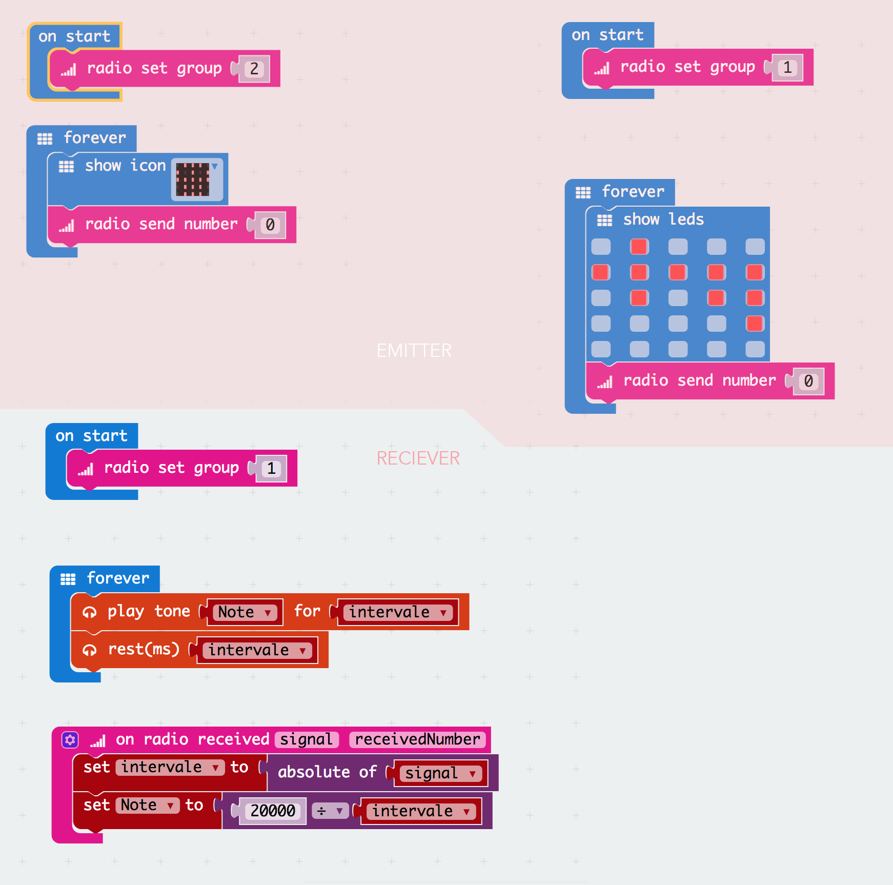

# DAY 4: The treasure hunt

With the help of technology and an old amnesiac pirate, the crew finds Barbe Bleu's treasure before he does.

## 1. Introductory unplugged activity

### Draw a treasure map (inpired by RTP Unseen Structure)

1) The crew members have to find the map to the treasure based on the instructions from an old amnesiac pirate. 
2) Once they find where the map is located (in a dark cave) the group is divided into two teams. 
3) Every team sends a scout to check the map in the cave. The scout has only 3 seconds to look at the map and help his team reproduce the map correctly. (We light the cave with a candle for few seconds)
4) Once every kid has gone to the cave and the map is complete, the two teams compare their maps.

```diff
Feed back of tests with KCJ team (21-06-2018): 
+ Very good feedback. Include darkness and a candle light for 3 seconds to visualize maps.
+ Simplify the Map for the Kids
```

## 2. Microbit activity 

> One MicroBit with radio to find the are where the treasure is found - General

```diff
+ TODAY WE LEARN:
1. What is a radio frequency?
2. How can we relate radio and sound?
3. What is a conditional in code?
4. What is a variable in code?
5. Play with the radio program and see how affects the sound.
```

### 2.1 Blocks Code

### 2.2 Text Code
> Emitter
```javascript
radio.setGroup(2)
basic.forever(() => {
    basic.showIcon(IconNames.Skull)
    radio.sendNumber(0)
})
```
>Reciever
```javascript
let Note2 = 0
let intervale = 0
radio.onDataPacketReceived( ({ signal, receivedNumber }) =>  {
    intervale = Math.abs(signal)
    Note2 = 20000 / intervale
})
radio.setGroup(2)
basic.forever(() => {
    music.playTone(Note2, intervale)
    music.rest(intervale)
})
```

## 2B. Art:Bit activity - code for begginers - Messages

1. They create their own Message send in Art:Bit

## 3. The treasure detector (inspired by Hot-Cold)

The crew programs their microbit to send radio signals of various strenghts so their microbit can be used as a range finder. With the help of their map and their special treasure detector, they can now hunt down the treasure.

1) One team is sent to find the key and the other is sent to find the treasure chest.
2) The range finder produces a sound which freqency increases with decreasing distance from the target. 
3) Once the team is very close to the target, they switch detection mode to detect the exact location of the target using a amgnetic field detector.

```diff
Feed back of tests with KCJ team (21-06-2018): 
+ Very good feedback. The Radio signal worked as expected within the programmed ranges.
+ Option of giving many Microbits with different sounds could be confusing.
+ Amplify the sound
```

> Authors: D.Banville and B.Ferragut

