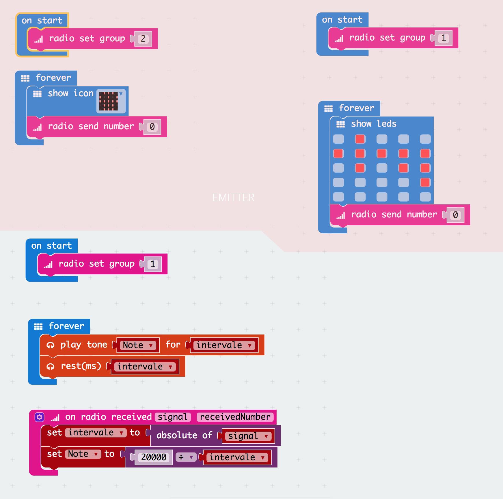

# DAY 4: The treasure hunt

With the help of technology and a pirate map, the crew finds the treasure and the key to open it.

## 1. Introductory unplugged activity

### Draw a treasure map (inpired by RTP Unseen Structure)

1) A map to the treasure is hidden in a close room guarded by an instructor. The map indicates the location of the key and the treasure chest in relationship with othe elements prenst on the camp site susch as roads, buildings, play areas, forest, etc.
2) The group is divided into two teams. 
3) Every team sends a scout to check the map in the cave. 
4) The scout has only 3 seconds to look at the map and help his team reproduce the map correctly. The instructor controls the time.
5) Once every kid has gone to the cave at least 2 times and the map is complete, the two teams compare their maps.

```diff
Feed back of tests with KCJ team (21-06-2018): 
+ Very good feedback. Include darkness and a candle light for 3 seconds to visualize maps.
+ Simplify the Map for the Kids
```

## 2. Makecode coding session - Older kids (age 8 to 12)


```diff
+ TODAY WE LEARN:
1. What is a radio frequency/group/channel?
2. What is a variable in code?
3. How to sense distance with radio?
```

### 2.1 Blocks Code

One microbit is the emitter. It broad cast a message all the time. This one is coded by the instructors and it represents the treasure or the key. We show the code but it is realy easy.

The other microbit is the reciever. This is the micrbit that is used to detect the treasure and that the kids have to code. This code is very similar to the one for the fish finder in day 2.



### 2.2 Text Code
> Emitter
```javascript
radio.setGroup(2)
basic.forever(() => {
    basic.showIcon(IconNames.Skull)
    radio.sendNumber(0)
})
```
>Reciever
```javascript
let Note2 = 0
let intervale = 0
radio.onDataPacketReceived( ({ signal, receivedNumber }) =>  {
    intervale = Math.abs(signal)
    Note2 = 20000 / intervale
})
radio.setGroup(2)
basic.forever(() => {
    music.playTone(Note2, intervale)
    music.rest(intervale)
})
```

## 3. Artbit coding session - Young kids (age 5 to 8)

```diff
+ TODAY WE LEARN:
1. What is a message?  
2. How can we send messages?
3. How can we receive message?
```


## 3. The treasure detector

The crew programs their microbit to send radio signals of various strenghts so their microbit can be used as a range finder. With the help of their map and their special treasure detector, they can now hunt down the treasure.

1) One team is sent to find the key and the other is sent to find the treasure chest.
2) The range finder produces a sound which frequency increases with decreasing distance from the target. 
3) Once the team is very close to the target, they switch detection mode to detect the exact location of the target using a amgnetic field detector.

```diff
Feed back of tests with KCJ team (21-06-2018): 
+ Very good feedback. The Radio signal worked as expected within the programmed ranges.
+ Option of giving many Microbits with different sounds could be confusing.
+ Amplify the sound
```
## 4. Changes to the plan

### Young kids (age 5 to 8)

We did not do the unplugged activity with the younger kids. Instead, we showed them our pirate map and explained them the different symbols and the fact that it was a top view of the camp. During the drawing activity, the kids had to draw there own pirate map to the treasure inspired by our map. This was a nice activity to develop abstraction. As for the coding activity, we had them create different images depending on what message they receive. The emitter was coded by the isntructor. As for the previous days, we did the treasure hunt game in parallel with the coding session.   

### Older kids (age 8 to 12)

We decided to introduce th concept of radio with a totaly different activity than originaly planned. In this activity, the kids create a collective work using the radio to pass message from one microbit to the next. They have to make up a story or a song of their choice as a team. Everyone has to have to right code for collective artwork to work. It is a very interesting activity to develop taem work and see leaders emerge.

*** PLEASE ADD THE DEMO CODE FOR THE INTRODUCTION TO RADIO (microbit-radio-colletive.hex in ./Makecode/Final/day4)***

## 4. Conclusions 

### Young kids (age 5 to 8)
1. **Unplugged Activities**

We introduced kids to what is a map and its symbols. The idea was that they start to understand what a map is, how it is an abstraction of the reality from the top view and how easy it is to identify objects on it. The results were fun and interesting.

2. **Coding**

We tryied to show the concept of radio. Some of the kids understood and achieved to goal of the activity (which was to show an image on message received). Some did not get it that much. We simply encouraged them to continue working on their animations.

3. **Taking the code out**

This game worked really well. This time we created two groups of about 7 kids. We gave them a microbit each and challenged them to find the treasure and the key. We first made a demo of how to detector works by making them listen to the changing sound of the receiver microbit as the instructor gets closer with the emitter. The instructor then hides the emitter. The little kids loved to go out with the beeping microbit in search of the treasure. The kids had to find a KEY and a SKULL representing the treasure to have success. With a little help and the detectors they succesfully find the treasure and the key within 10 to 15 minutes. Once the tresure was found, we proceeded to the distribution of the treasure (plastics gems and golden coins).

### Older kids (age 8 to 12)
1. **Unplugged Activities**

The memory game was a success. Both teams had fun memorizing the map and localizing the treasure. This is a game that we recommend alongside with the architect and the secret object as unplugged activities.

2. **Coding**

In this class we opened the class to experimentation in radio communication. We teach them the basics about how to send a message and after that we designate some 'leaders' in the class to help create a series of images and sounds along all the microbits through sending messages in different channels. We enjoyed the game a lot, we would just recommend to choose the 'right' leaders and maybe create a very well defined objective so they have to take less decisions and keep focus on the activity. Giving the kids responsability was a great idea. From that point, they were on their own and they had to cooperate all together to accomplish the objective. We observed very interesting dynamics. We found that with a little structure, it is possible to give the kids power and responsability on the problem solving process.

3. **Taking the code out**

The treasure hunt was a success with this age group too. We made the research a little more challenging for them.


Authors: B.Ferragut and D.Banville - June 2018

© 2012 - 2018 Kids Code Jeunesse | All Right Reserved

