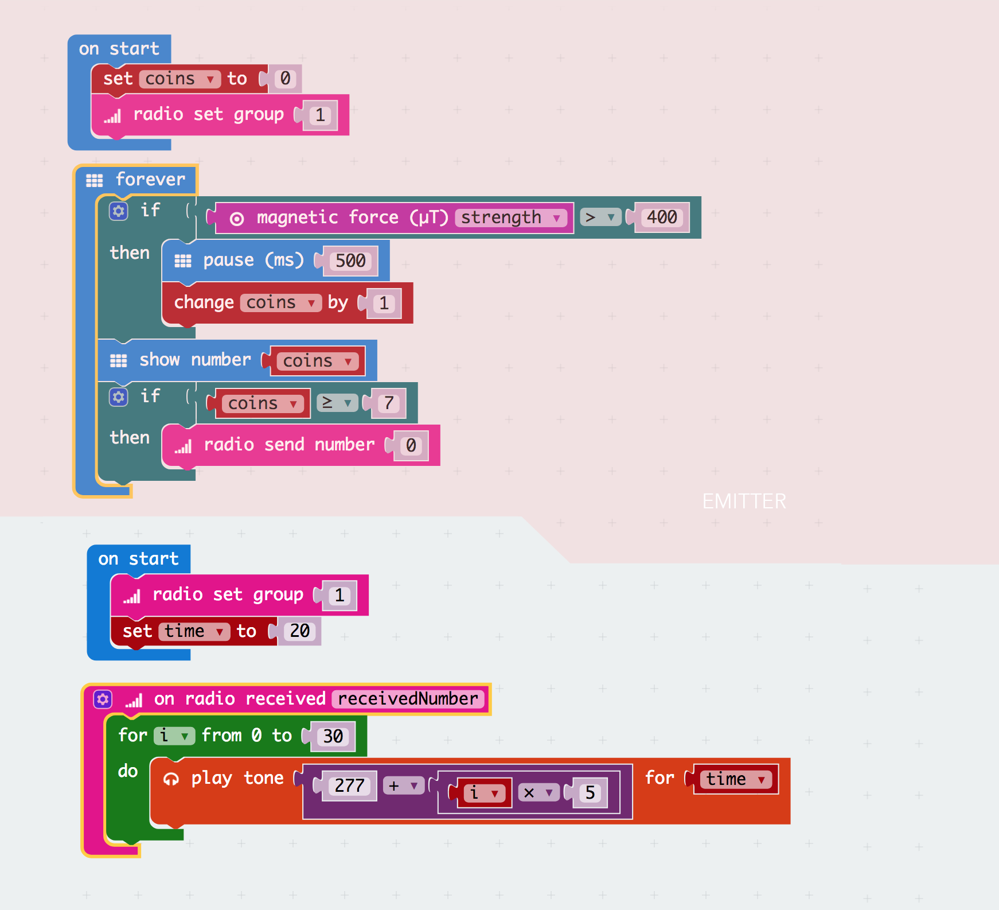

# DAY 5: The final battle

It is well known that pirates like to fight just for fun.

## 1. Introductory unplugged activity

### Build an unbreakable treasure chest

There is a lot to do to get ready for the battle. First the team has to build an unbreakable treasure chest that looks awesome and that contains the heart of their captain.

## 2. Microbit activity

### Add technological security features to your treasure chest

The treasure chest can be opened only if every team member puts in his/her coin. The chest is also equiped with an alarm system that warns the team if it has been opened. The team has to write two different microbit programs to achieve these functionnality.

> Program:
1. A coin counter for opening the chest - We count 7 magnets - if we have them
2. An alarm system to detect the opening of the chest

### 2.1 Blocks Code

### 2.2 Text Code
> Emitter
```javascript
let coins = 0
input.onButtonPressed(Button.A, () => {
    coins += -1
})
input.onButtonPressed(Button.AB, () => {
    coins = 0
})
input.onButtonPressed(Button.B, () => {
    coins += 1
})
coins = 0
radio.setGroup(1)
basic.forever(() => {
    if (input.magneticForce(Dimension.Strength) > 400) {
        basic.pause(500)
        coins += 1
    }
    basic.showNumber(coins)
    if (coins >= 7) {
        radio.sendNumber(0)
    }
})
```
>Reciever
```javascript
let time = 0
radio.onDataPacketReceived( ({ receivedNumber }) =>  {
    for (let i = 0; i <= 30; i++) {
        music.playTone(277 + i * 5, time)
    }
})
radio.setGroup(1)
time = 20
```

## 3. The final battle: a complex capture the flag type of game

The final battle is in three stages:

> Define their own strategy to capture the Heart

0. Two delimited bas camps - draw a huge circle
1. Each player has a flag on its back. Ecah player has a coin - 7
2. They need to enter to the opposite side with the flag on their back.
3. Once they are in the safe zone - They can introduce the coin - coin counter adds+1
4. All members need to insert a coin - When we have 7 coins the coffin be opened.
5. Once they open the coffin the Alarm sounds ( light detector )
6. The winner of the round is the team that successfully brings the captain's heart back to their base. The round is a draw if the heart is successfully intercepted by the defenders or if it is dropped.


Authors: D. Banville and B. Ferragut

## TODO

1. Add visual representation of the logic in day 3
2. Add a chart of the different values (pitch, interval and signal) for the range finders of day 2 and 4